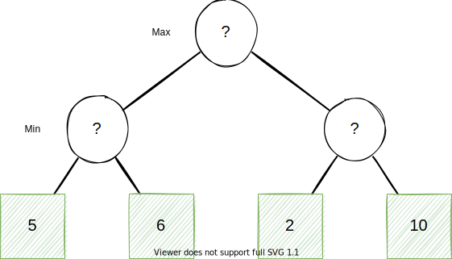
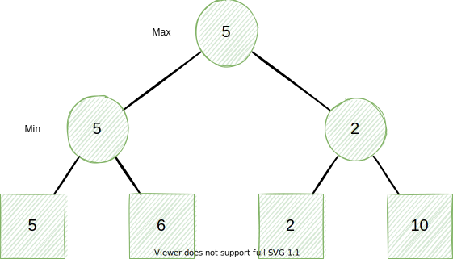

# Simple Chess Engine
[](https://repl.it/github/Kyle-L/Simple-Chess-Engine)

- [Introduction](#introduction)
- [What is Minimax?](#what-is-minimax)
  - [Minimax Pseudocode](#minimax-pseudocode)
- [What is Alpha-Beta Pruning](#what-is-alpha-beta-pruning)
- [Minimax with Alpha-Beta Pruning Pseudocode](#minimax-with-alpha-beta-pruning-pseudocode)
- [The Chess Engine](#the-chess-engine)
- [Local Setup](#local-setup)
- [References](#references)

## Introduction
As a simple assignment for my [Introduction to Artificial Intelligence course (CSE 486)](https://www.miamioh.edu/cec/academics/departments/cse/academics/course-descriptions/cse-486-586/index.html) at Miami University, we were tasked with building a simple chess engine which makes use of the minimax algorithm with alpha-beta pruning.

Now admittedly, I am not horribly competent at playing chess. While I know how the pieces move, at least before writing this, I lacked a basic understanding of strategy. Nonetheless however, I will do my best to explain how the engine works, what and why minimax with alpha-beta pruning is used, and how you can run this code.

## What is Minimax?
Minimax is a backtracking algorithm that is used in decision making and game theory to determine the best set of choices for an agent to make. Minimax is most notably used in many two player turn-based games such as Tic-Tac-Toe.

At the core of minimax is the concept that one player is always trying to maximize and the other is trying to minimize.

For instance, say you have an arbitrary game with two turns where one player is trying to have the highest score possible while the other is trying to minimize that player's score. This can be represented by *figure 1*.

*Figure 1.*


To determine the best decision for the player trying to maximize, we will start at the bottom and figure out which numbers the other player will choose. Logically, these are the minimums. Once we have these numbers, we can determine that the best decision is the maximum of the found minimums. This looks like figure 2.

*Figure 2*


### Minimax Pseudocode
The pseudocode for a depth limited minimax algorithm is given below [[1]](#references). 

```
function minimax(node, depth, maximizingPlayer) is
    if depth = 0 or node is a terminal node then
        return the heuristic value of node
    if maximizingPlayer then
        value := −∞
        for each child of node do
            value := max(value, minimax(child, depth − 1, FALSE))
        return value
    else (* minimizing player *)
        value := +∞
        for each child of node do
            value := min(value, minimax(child, depth − 1, TRUE))
        return value
```

## What is Alpha-Beta Pruning
While minimax is great at determining the best decision, it can get extremely costly when there are a lot of possible decisions (for instance in Chess). To help make minimax faster, we can use alpha-beta pruning to avoid checking certain parts of the decision tree. This is done by using an alpha and beta value where alpha is the highest value thus far and beta is the lowest thus far.

For instance, if we apply to the above tree. Set the of steps will look like:

1. First, we pretend alpha and beta is -∞ and ∞ respectfully.
2. Second, we look at all leafs nodes of the left most node and choose 5. Because 5 is greater than -∞, the new alpha is 5.
3. Third, once we get to 2, since it is less than 5, we determine that we no longer need to check anymore nodes on this side of the tree, so we prune 10 from the tree and don't check it.
4. Between 5 and 2, the maximizing player chooses 5 intuitively.

At the core of alpha-beta pruning is simply, if beta is less than or equal to alpha, we can prune the rest of a tree we are checking since we know that the maximizing or minimizing player will not choose it. Additionally, the alpha is only set by the maximizing player and the beta is only set by the minimizing player.

## Minimax with Alpha-Beta Pruning Pseudocode
The pseudo-code for a depth limited minimax with alpha–beta pruning is given below [[2]](#references).

```
function alphabeta(node, depth, α, β, maximizingPlayer) is
    if depth = 0 or node is a terminal node then
        return the heuristic value of node
    if maximizingPlayer then
        value := −∞
        for each child of node do
            value := max(value, alphabeta(child, depth − 1, α, β, FALSE))
            if value ≥ β then
                break (* β cutoff *)
            α := max(α, value)
        return value
    else
        value := +∞
        for each child of node do
            value := min(value, alphabeta(child, depth − 1, α, β, TRUE))
            if value ≤ α then
                break (* α cutoff *)
            β := min(β, value)
        return value
```

## The Chess Engine
Now that Minimax with alpha-beta pruning is understood, how it this applied to a chess engine? In chess, there is an average of 35 possible moves that a player can make at any given time [[3]](#references). So for instance, after each player has moved a piece 5 times each there are exactly 69,352,859,712,417 possible games that could have been played. Unfortunately, we are not able to determine every possible move that a player can make (we don't have that much computing power). Instead of predicating every possible game though, we will use a heuristic function which will evaluate the state of a chess board and assign it a value.

The heuristic function is composed of two parts:
1. A point values for each game piece on the board.
2. A point values for the position of each game piece on the board.

Values for Pieces:
```
- Pawns: 100
- Knights: 300
- Bishops: 300
- Rook: 500
- Queen: 900
```

Values for Positions:
```
PAWN_TABLE = [
    0,  0,  0,  0,  0,  0,  0,  0,
    50, 50, 50, 50, 50, 50, 50, 50,
    10, 10, 20, 30, 30, 20, 10, 10,
    5,  5, 10, 25, 25, 10,  5,  5,
    0,  0,  0, 20, 20,  0,  0,  0,
    5, -5,-10,  0,  0,-10, -5,  5,
    5, 10, 10,-20,-20, 10, 10,  5,
    0,  0,  0,  0,  0,  0,  0,  0
]

KNIGHTS_TABLE = [
    -50,-40,-30,-30,-30,-30,-40,-50,
    -40,-20,  0,  0,  0,  0,-20,-40,
    -30,  0, 10, 15, 15, 10,  0,-30,
    -30,  5, 15, 20, 20, 15,  5,-30,
    -30,  0, 15, 20, 20, 15,  0,-30,
    -30,  5, 10, 15, 15, 10,  5,-30,
    -40,-20,  0,  5,  5,  0,-20,-40,
    -50,-40,-30,-30,-30,-30,-40,-50
]

BISHOPS_TABLE = [
    -20,-10,-10,-10,-10,-10,-10,-20,
    -10,  0,  0,  0,  0,  0,  0,-10,
    -10,  0,  5, 10, 10,  5,  0,-10,
    -10,  5,  5, 10, 10,  5,  5,-10,
    -10,  0, 10, 10, 10, 10,  0,-10,
    -10, 10, 10, 10, 10, 10, 10,-10,
    -10,  5,  0,  0,  0,  0,  5,-10,
    -20,-10,-10,-10,-10,-10,-10,-20
]

ROOKS_TABLE = [
    0,  0,  0,  0,  0,  0,  0,  0,
    5, 10, 10, 10, 10, 10, 10,  5,
    -5,  0,  0,  0,  0,  0,  0, -5,
    -5,  0,  0,  0,  0,  0,  0, -5,
    -5,  0,  0,  0,  0,  0,  0, -5,
    -5,  0,  0,  0,  0,  0,  0, -5,
    -5,  0,  0,  0,  0,  0,  0, -5,
    0,  0,  0,  5,  5,  0,  0,  0
]

QUEENS_TABLE = [
    -20,-10,-10, -5, -5,-10,-10,-20,
    -10,  0,  0,  0,  0,  0,  0,-10,
    -10,  0,  5,  5,  5,  5,  0,-10,
    -5,  0,  5,  5,  5,  5,  0, -5,
    0,  0,  5,  5,  5,  5,  0, -5,
    -10,  5,  5,  5,  5,  5,  0,-10,
    -10,  0,  5,  0,  0,  0,  0,-10,
    -20,-10,-10, -5, -5,-10,-10,-20
]

KINGS_TABLE = [
    -50,-40,-30,-20,-20,-30,-40,-50,
    -30,-20,-10,  0,  0,-10,-20,-30,
    -30,-10, 20, 30, 30, 20,-10,-30,
    -30,-10, 30, 40, 40, 30,-10,-30,
    -30,-10, 30, 40, 40, 30,-10,-30,
    -30,-10, 20, 30, 30, 20,-10,-30,
    -30,-30,  0,  0,  0,  0,-30,-30,
    -50,-30,-30,-30,-30,-30,-30,-50
]
```

Using these values, the sum of the game pieces present and their positions is used to find a single value for the board. The higher the value, the better it is for white. The lower the value, the better it is for black.

## Local Setup
If you would like to setup the Chess Engine on your local machine, you can use the following instructions!

1. Download the site.
```shell
$ git clone git@github.com:Kyle-L/Simple-Chess-Engine.git
```
2. Install Pipenv using pip, install pip if you haven't already.
```shell
$ pip install pipenv
```

3. Setup a virtual environment with Pipenv.
```shell
$ python -m venv env
```

4. (on Windows) Start the virtual environment
```shell
$ ./env/Scripts/activate
```

4. (on Unix / Linux / MAC OS) Start the virtual environment
```shell
$ source env/bin/activate
```

5. Install the requirements
```shell
$ pip install -r requirements.txt
```

6. Run the chess engine!
```shell
$ python ./engine.py
```

Congrats! You are setup!

## Remote Setup
If you would like to use the chess engine remotely, we can use the online IDE Repl.it!


## References
[1] “Minimax,” Wikipedia. Aug. 05, 2021. Accessed: Oct. 02, 2021. [Online]. Available: https://en.wikipedia.org/w/index.php?title=Minimax&oldid=1037267004

[2] “Alpha–beta pruning,” Wikipedia. Aug. 22, 2021. Accessed: Oct. 02, 2021. [Online]. Available: https://en.wikipedia.org/w/index.php?title=Alpha%E2%80%93beta_pruning&oldid=1040138372

[3] “Branching factor,” Wikipedia. May 01, 2021. Accessed: Oct. 02, 2021. [Online]. Available: https://en.wikipedia.org/w/index.php?title=Branching_factor&oldid=1020914491
